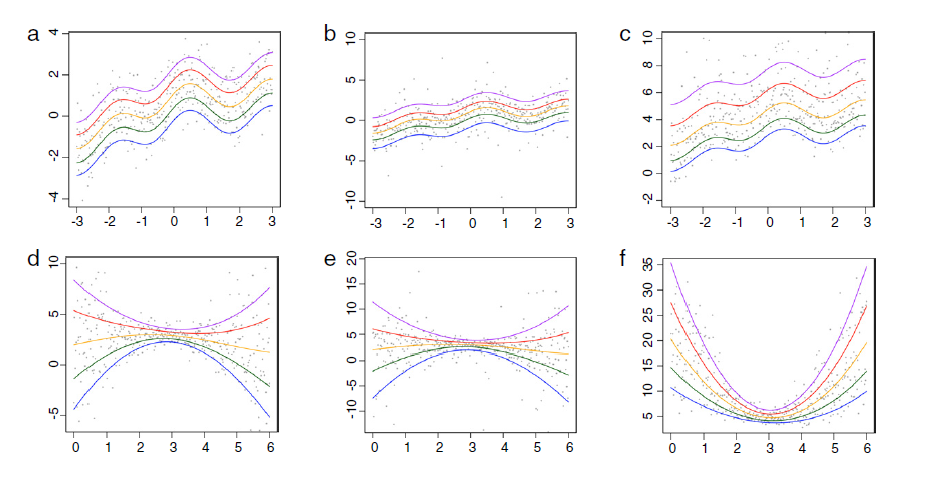
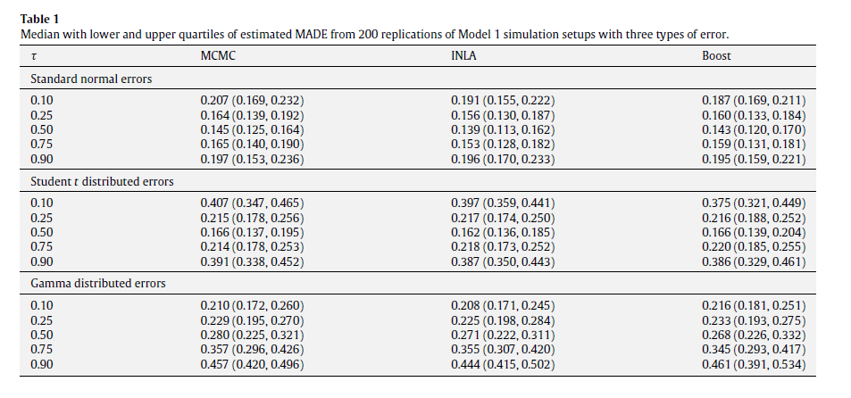
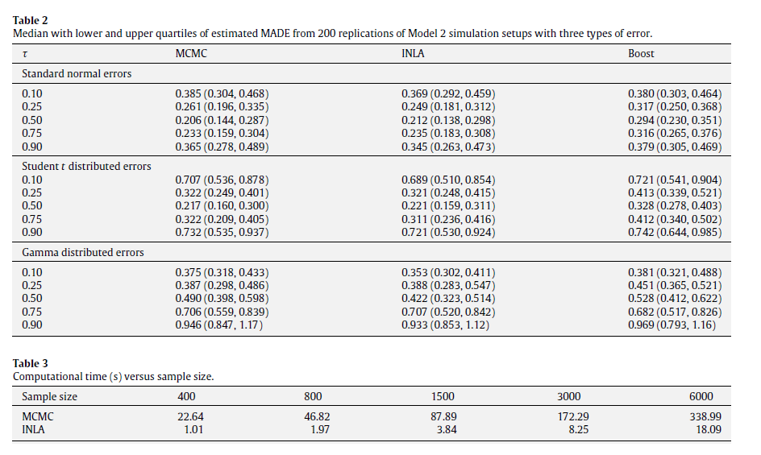
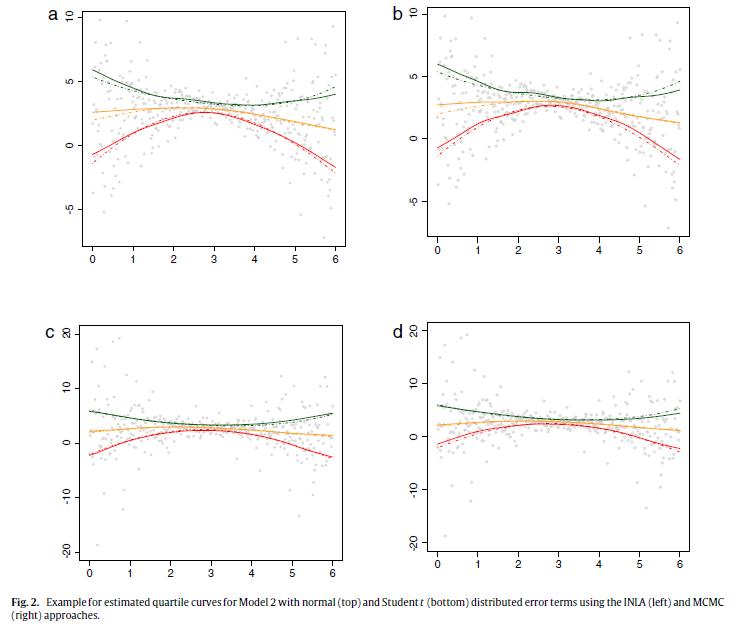
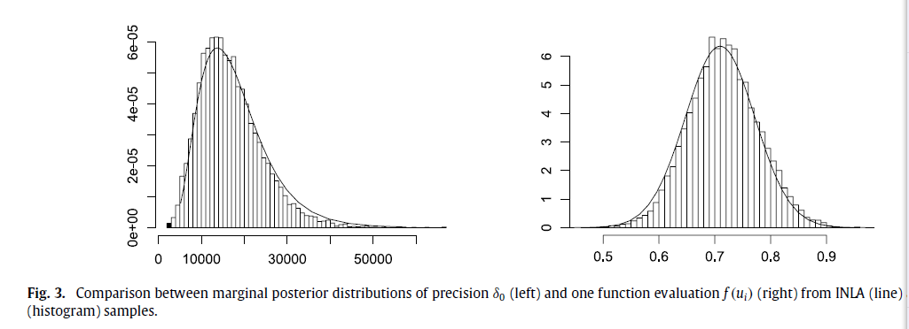
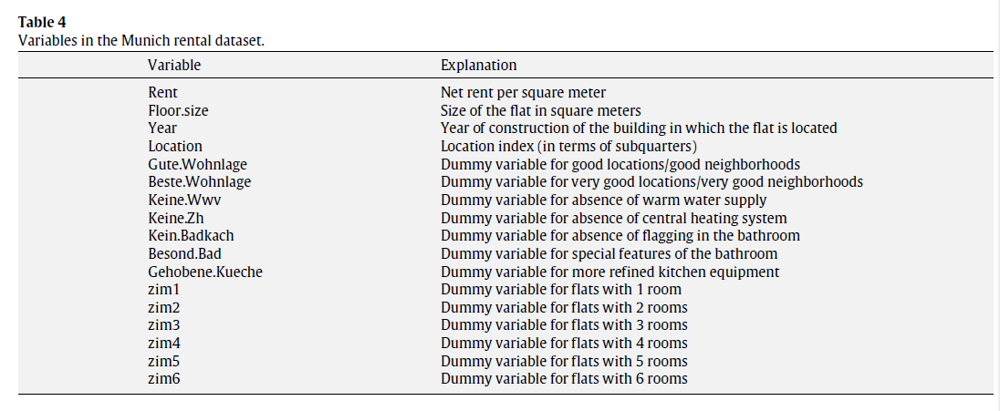
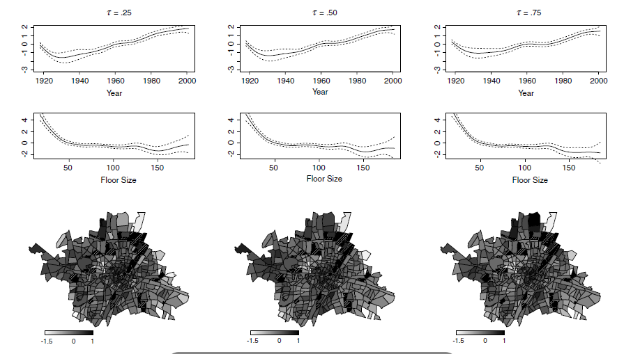
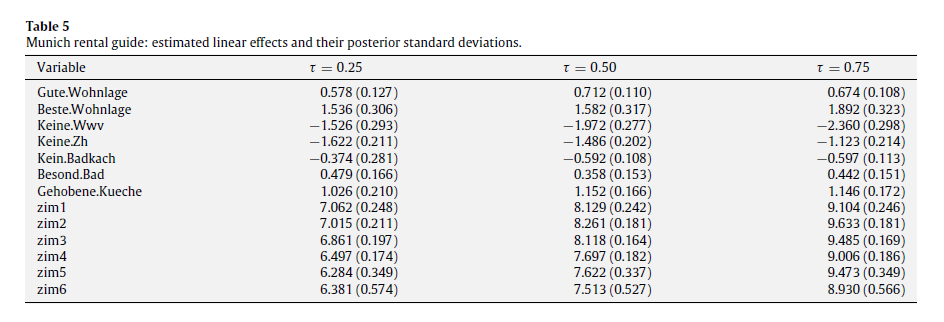

## Fig 1 ##


--- bg:#EEE

### performance ###
> - 1.对于每一次模拟的数据集，我们分别用**MCMC**方法和**INLA**方法对不同分位数下的STAQ模型进行估计，并与自助模型进行比较。选择CRW2模型作为两种方法的函数先验，选择离散的gamma分布(a=1,c=0.001)作为精度参数的先验。
$$ MADE=\frac{1}{n}|Q_{k}(\tau|u)-\widehat{Q_{k}}(\tau|u)|,k=1,2, $$

> - 2.计算绝对值偏差的均值(MADEs),并重复试验200次，根据所得结果来评价估计的效果。
Fig2展示了误差项分别服从正态和t分布时，估计的分位数曲线。Fig3展示了俩种估计方法得到的后验样本的直方图。

> - 3.Table3 比较了俩种方法在不同的样本大小下计算的时间。

> - 4.当估计比较极端的分位数时，**MCMC**方法表现要逊于**INLA**。当模拟的样本大小少于400时，例如，我们计算了当n=100和250，MADE的结果和n=400时表现结果相似，尽管值比较大。

---

## Table 1 ##


---

### Table2 and Table 3 ###


---

### Fig2 ###
</img>

---

### Fig3 ###
</img>
>- Conclusion
      + (i)对于贝叶斯非参数回归推断来说，假设似然函数是ALD是合适的。
      + (ii) STAQ模型的performance是具有竞争性的。
      + (iii) INLA提供了一种相当好的近似方法。

---  bg:#EEE


---  

## 5.2. Munich rental guide ##
我们来分析2003年Munich租金的数据集，响应变量 $y_{i}$ 是公寓租金，协变量有空间
位置($u_{i}$),地板空间大小($size_{i}$),建造日期($year_{i}$)以及不同的指示变量。数据集由2035个观测组成。响应变量是偏斜异质性分布的事实表明，用分位数回归拟合是合适的。


--- bg:#EEE
### geoadditive model ###

>- 对于第$\tau$个分位数回归，我们建立一个空间可加模型：
$$ \eta_{\tau i}=x_{i}^{T}\beta_{\tau}+f_{\tau1}(size_{i})+f_{\tau2}(year_{i})+f_{\tau3}(u_{i}) $$


>- 其中 $x_{i}$ 代表13个维度的类别型协变量，函数 $f_{\tau 1}$ 和 $f_{\tau 2}$ 是关于地板大小和建造时间的非线性函数，函数 $f_{\tau 3}$ 代表着空间效应模型(基于Munich地区离散的空间信息)


>- 用**INLA**方法估计三个分位数模型($\tau=0.25,0.5,0.75$),其中的调节参数$\gamma=2$,超参数$a=1,b=0.001$.我们将看到，分位数推断可以观察到一些均值回归看不到的有用信息。

---

## Fig.4 ##


---

## information ##

>- 仔细观察fig.4.,对比 $\tau=0.75$ 和 $\tau=0.25$ 时的租金关于year和floor size的分位数图像，你发现了什么？你可以解释其中的原因吗?

>- 可以用你的话描述空间位置影响租金的图像吗？

>- Table5 是用INLA估计得到的参数值，解释一下随着$\tau$的增大，变量Keine.Zh和Kein.Badkach为什么有显著的增长以及变量Keine.Www却下降了。

--- bg:#EEE

## Final remarks ##
1.对于可加混合模型，我们提供了两种推断方法，并通过模拟研究考虑了两种方法的精确性和计算效率

2.Munich rental 的例子显示了我们STAQ模型的有效性。

3.需要指出的是，用此模型去估计极端的分位数是困难的。

4.未来我们可以研究用STAQ模型来对计数和两变量的数据进行分位数推断。

---  bg:yellow
# Appendix
```
library(INLA)
data(Munich)
```
```
g <- system.file("demodata/munich.graph", package="INLA")

formula <- rent ~ f(location, model = "besag", graph.file = g,
                   param = c(1,0.001)) +
                  f(year, model="crw2", values = seq(1918,2001), param = c(1,0.001)) +
                  f(floor.size, model = "crw2", param = c(1,0.001)) +
                  Gute.Wohnlage + Beste.Wohnlage + Keine.Wwv + Keine.Zh +
                  Kein.Badkach + Besond.Bad + Gehobene.Kueche +
                  zim1 + zim2 + zim3 + zim4 + zim5 + zim6 -1
mod <- inla(formula, data = Munich, verbose = T, family = "laplace",
             control.family =list(alpha = 0.5, gamma = 2, epsilon = 0.01),
             control.predictor = list(initial = 12), 
             control.inla = list(h = 1e-3))
```

---



---


